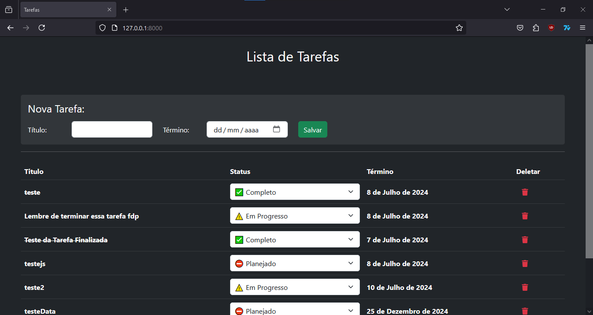

## Projeto: Lista de Tarefas

- **Autor:** Bruno Henrique

- **Descrição:** Lista de tarefas feita como estudo de Django (Python) e Ajax.

- **Inspiração no curso:** [Construindo uma Lista de Tarefas Dinâmica com Django e AJAX
](https://www.udemy.com/share/10bmMZ3@n0beaSF0q5bUpXG2O7z49jOkNs43gPu5hpbFYDybbaowHVv-NOY9gy4xkIPgWMVB/)

- **Resultado:**

